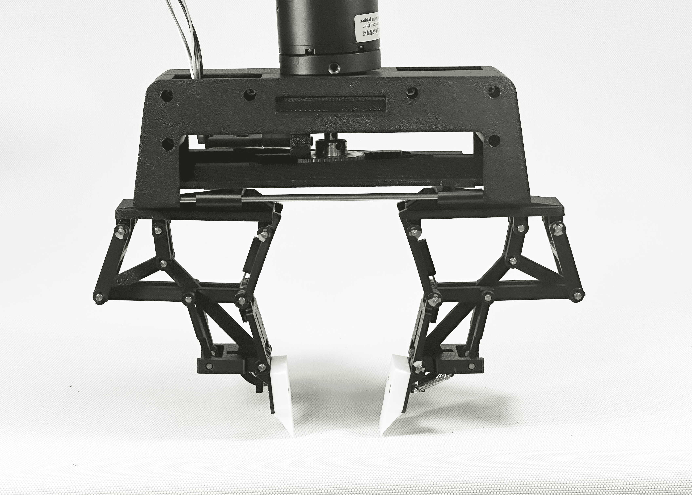

## The Challenge

Grasping objects in cluttered or constrained environments remains a fundamental challenge in robotics. Traditional robotic hands often rely on complex sensor arrays and active control loops, which increase cost and reduce robustness. What if we could design a hand that adapts **passively** to the object and the environment?

## The Idea

That is exactly what we set out to do with the **SPARK Hand** — a Scooping-Pinching Adaptive Robotic Hand based on a novel linkage mechanism inspired by Kempe's coupler curves. The key idea: use the environment itself (e.g., a table surface) as a constraint to guide the grasp, achieving a reliable vertical scooping-pinch motion without any external sensors.

## Design Process

We designed the entire kinematic chain from scratch, iterating through dozens of linkage configurations in SolidWorks before settling on a design that maximizes the scooping workspace while maintaining a compact form factor. The hand was fabricated using a combination of 3D-printed joints and laser-cut links, keeping the total cost under **$50**.

### Key Design Features

- **Kempe mechanism** for generating precise coupler curves
- **Dual-mode grasping**: scooping for flat objects, pinching for cylindrical ones
- **Passive adaptation** through spring-loaded joints
- **Low-cost fabrication** using 3D printing and laser cutting

The design process involved careful trade-offs between workspace size, grasp force, and mechanical complexity.

## Competition & Results

At the [2025 ASME Student Mechanism & Robot Design Competition](https://sites.google.com/site/asmemrc/design-competition-showcase), we presented the SPARK Hand in the Undergraduate Category and won **1st Place**.

> The elegance of the SPARK Hand lies in its simplicity: no sensors, no microcontrollers, just pure mechanism design working in harmony with the environment.

## What's Next

This project taught me that elegant mechanism design can sometimes outperform brute-force control. I am now exploring how similar passive principles can be applied to whole-body manipulation in humanoid robots.
